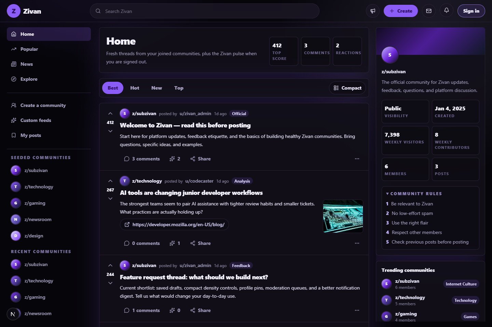
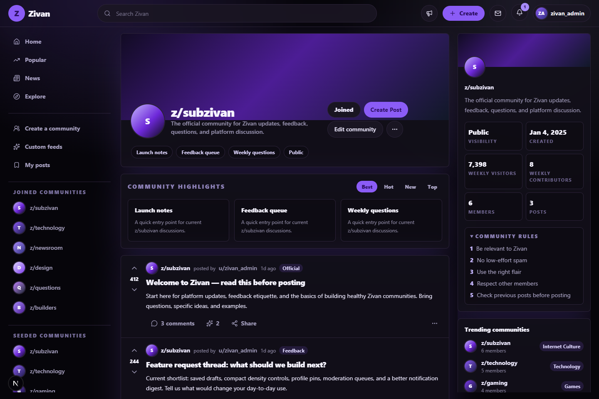
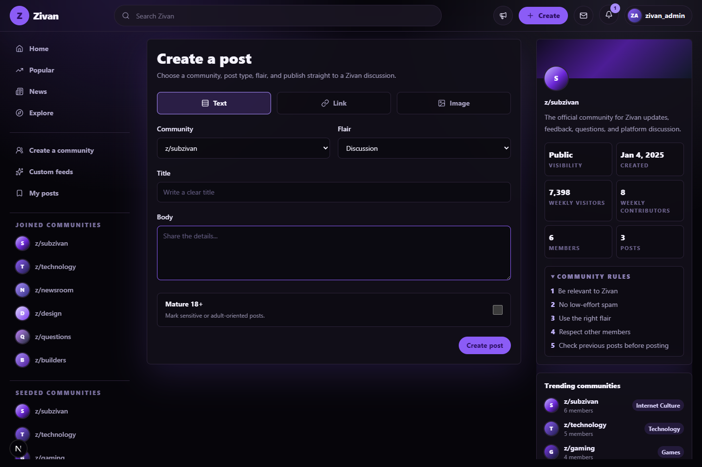
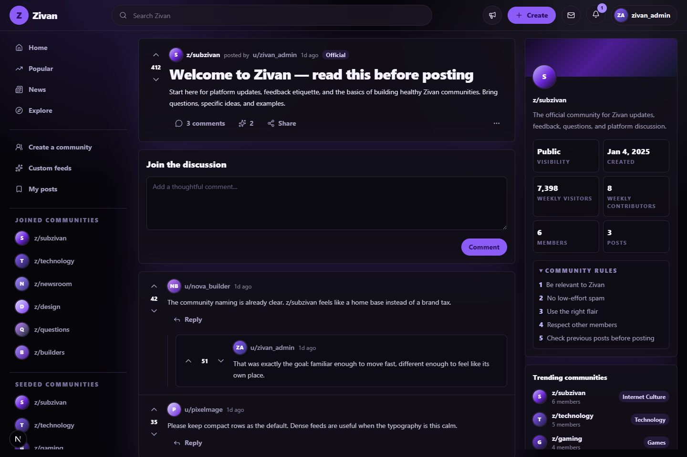
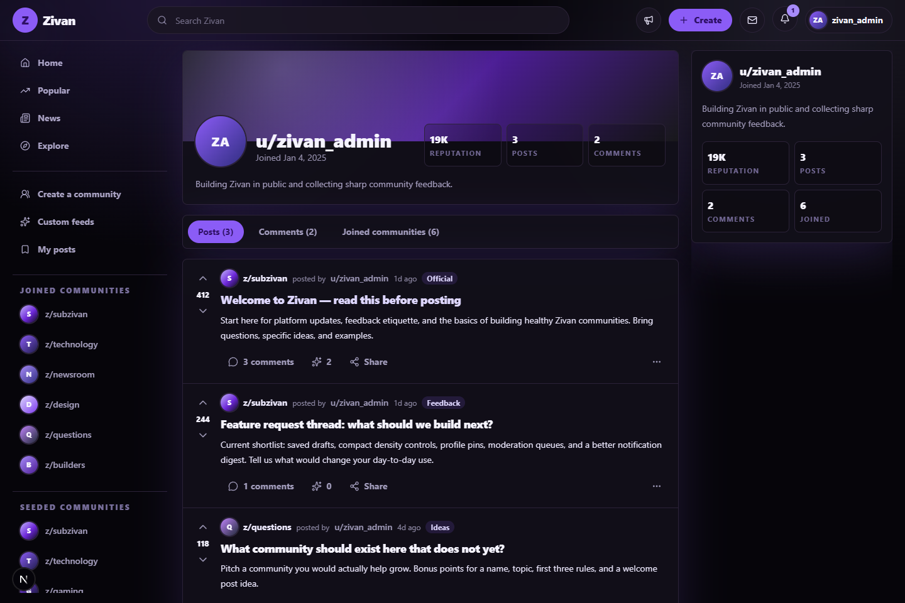

# Zivan

Zivan is a Reddit-inspired social community MVP built with Next.js, TypeScript, Tailwind CSS, and localStorage persistence.

It is designed for focused discussions, community discovery, and user-driven content. Zivan features a polished purple-and-black interface, community feeds using the `z/` prefix, post creation, threaded comments, voting, reactions, search, notifications, user profiles, and community creation tools. The app is fully seeded with demo users, communities, posts, comments, and notifications so it feels active immediately after launch.

## Quick Start

```bash
git clone https://github.com/Mratter/Zivan.git
cd Zivan
npm install
npm run dev
```

Open `http://localhost:3000`.

## Screenshots

### Home Feed



### Community Page



### Post Creation



### Comments And Thread View



### Profile Page



## Features

- Responsive purple-and-black social feed UI
- Fixed top navigation with global search
- Desktop sidebars and mobile-friendly collapsed navigation
- Community routes such as `/z/subzivan`
- Post routes such as `/z/subzivan/comments/p_welcome`
- User profile routes such as `/u/zivan_admin`
- Sign up, sign in, sign out, and local session persistence
- Text, link, and image post creation
- Sorting controls for Best, Hot, New, and Top
- Voting, reactions, sharing, saving, and hiding posts
- One-level nested comment replies
- Join and leave communities
- Search results for posts, communities, and users
- Notifications dropdown and notifications page
- Multi-step community creation wizard
- Basic owner moderation settings for description, banner, avatar, and rules
- Seeded demo users, posts, comments, and notifications

## Seeded Demo Data

Zivan initializes localStorage with realistic demo content on first load.

Seeded users include:

- `zivan_admin`
- `nova_builder`
- `codecaster`
- `nightowl`
- `pixelmage`
- `orbit_reader`

Seeded communities include:

- `z/subzivan`
- `z/technology`
- `z/gaming`
- `z/newsroom`
- `z/design`
- `z/questions`
- `z/movies`
- `z/builders`

All seeded demo accounts use:

```text
Password: zivan123
```

## Technical Decisions

### Why localStorage?

Zivan uses localStorage so the MVP can run anywhere without a backend, database, auth provider, or deployment setup. This keeps the project easy to clone, review, and demo while still supporting persistent app state after refresh.

### How seeded data works

The app creates an initial state containing users, communities, posts, comments, votes, reactions, saved posts, hidden posts, notifications, and the active session. On first load, that seed state is stored in localStorage. Later actions update the same state model, so the app behaves like a real product demo instead of a static mockup.

### Data model

The core entities are:

- Users with profile data, reputation, avatar, and join date
- Communities with rules, privacy, topic, banner, avatar, members, and highlights
- Posts with type, title, body, link or image fields, flair, community, author, and score
- Comments with parent IDs for one-level replies
- Votes and reactions stored separately so duplicate votes can be prevented per user
- Notifications generated by comments, replies, and community creation

### What would change with a real backend?

With a production backend, localStorage would be replaced by database tables or collections. Authentication would move to secure server-side sessions or an auth provider. Voting, comments, and notifications would become API-backed mutations. Community moderation would need permission checks on the server, and search would likely use indexed database queries or a search service.

## What I Learned

Building Zivan was a good exercise in turning a familiar social platform pattern into a distinct product with its own naming, theme, routes, and interaction model. The most important design challenge was keeping the UI dense like a forum feed while still making it readable in a dark theme.

Key lessons:

- A clear seed data model makes frontend MVPs feel much more realistic.
- localStorage can support surprisingly complete product demos when state is structured well.
- Route conventions matter because they shape how the whole product feels.
- Dense layouts need careful spacing, typography, and muted borders to avoid visual noise.
- Auth-protected actions should fail gracefully with prompts instead of dead buttons.

## Scripts

```bash
npm run dev
npm run build
npm run lint
npm test -- --run
```

## Suggested Repository Topics

`nextjs`, `typescript`, `tailwindcss`, `social-platform`, `community`, `reddit-clone`, `frontend`, `localstorage`
